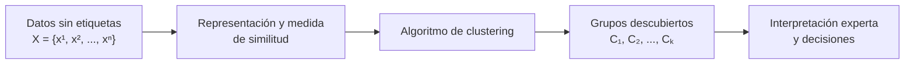

# Investigación y Desarrollo sobre Algoritmos de Clustering

### Parte 1 · Algoritmos no supervisados de clustering

---

**Bootcamp de Inteligencia Artificial · Módulo 2 · Tarea 5**

## Descripción

Esta investigación estudia cómo funcionan los algoritmos de *clustering*, sus principales tipos, ventajas, desventajas y aplicaciones en el mundo real.

> **Objetivo:** comprender los fundamentos del aprendizaje no supervisado y analizar los distintos enfoques utilizados para descubrir agrupaciones en los datos.

## Índice

1. [Aprendizaje no supervisado y algoritmos de clustering](#1-aprendizaje-no-supervisado-y-algoritmos-de-clustering)

---

## 1. Aprendizaje no supervisado y algoritmos de clustering

### Preguntas de investigación

- ¿Qué es el aprendizaje no supervisado?
- ¿Qué es un algoritmo de *clustering*?
- ¿En qué se diferencia del aprendizaje supervisado?
- ¿Cuál es su propósito?

### 1.1. Aprendizaje no supervisado

El **aprendizaje no supervisado** es una rama del aprendizaje automático en la que el modelo recibe observaciones, pero **no conoce una respuesta correcta asociada a cada una**. En lugar de aprender a predecir una etiqueta ya definida, busca estructura en los datos: grupos, patrones frecuentes, relaciones, componentes latentes o casos inusuales.

Si el conjunto de datos es

$$
\mathcal{D}=\{\mathbf{x}^{(1)},\mathbf{x}^{(2)},\ldots,\mathbf{x}^{(n)}\},
\qquad \mathbf{x}^{(i)} \in \mathbb{R}^{p},
$$

cada observación $\mathbf{x}^{(i)}$ tiene $p$ características, pero no dispone de una variable objetivo $y^{(i)}$. El análisis parte de una pregunta exploratoria: **«¿qué organización interna sugieren los propios datos?»**

Por ejemplo, una tienda puede registrar para cada cliente su frecuencia de compra, gasto medio y categoría favorita, sin saber de antemano si pertenece al segmento «ocasional», «premium» o «sensible a ofertas». Un método no supervisado puede revelar segmentos con comportamientos parecidos; después, una persona interpreta y nombra esos grupos.

> **Idea clave:** los datos no traen la respuesta; el algoritmo propone una estructura que debe ser analizada y validada.

### 1.2. Algoritmos de clustering

Un algoritmo de **clustering** (o agrupamiento) es un método no supervisado que organiza las observaciones en grupos llamados *clusters*. Busca que los elementos de un mismo grupo sean más similares entre sí que respecto a los elementos de otros grupos, según una medida de similitud o distancia adecuada al problema.

En un agrupamiento «duro» con $K$ grupos, el resultado puede expresarse mediante una función:

$$
c: \mathbf{x}^{(i)} \longmapsto \{1,2,\ldots,K\},
$$

donde $c(\mathbf{x}^{(i)})$ asigna cada observación a un único cluster. La noción de «parecido» no es universal: puede medirse con distancia euclídea entre variables numéricas, similitud coseno entre textos vectorizados o una distancia diseñada para datos de otro tipo. Elegirla bien es parte esencial del problema.

En términos generales, se persiguen dos propiedades:

| Dentro de cada cluster | Entre clusters |
| :--- | :--- |
| **Alta cohesión:** los puntos son parecidos o están próximos. | **Alta separación:** los grupos son distinguibles entre sí. |

Un cluster **no es automáticamente una clase real**. El algoritmo detecta regularidades geométricas o estadísticas; corresponde al conocimiento del dominio decidir si esas regularidades tienen significado útil.

**Ejemplo intuitivo.** Si representamos canciones por rasgos como energía, tempo y acústica, un algoritmo puede reunir canciones similares. Esos grupos podrían interpretarse como estilos de escucha o contextos de uso, pero ningún algoritmo sabe por sí mismo que un grupo debe llamarse «para entrenar».

### 1.3. Diferencias frente al aprendizaje supervisado

En aprendizaje **supervisado**, cada ejemplo sí incluye una respuesta conocida. El conjunto de entrenamiento tiene la forma:

$$
\mathcal{D}_{sup}=\{(\mathbf{x}^{(i)},y^{(i)})\}_{i=1}^{n},
$$

y el modelo aprende una función $f$ que aproxime $y \approx f(\mathbf{x})$. Si $y$ es una categoría se trata de **clasificación**; si es un valor numérico, de **regresión**. Su rendimiento puede comprobarse comparando predicciones con etiquetas reales que el modelo no ha visto.

| Aspecto | Aprendizaje supervisado | Aprendizaje no supervisado / clustering |
| :--- | :--- | :--- |
| Datos de entrada | Características **y etiquetas** conocidas $(X, y)$ | Solo características $X$ |
| Pregunta principal | «¿Qué valor o clase predigo?» | «¿Qué estructura o grupos existen?» |
| Resultado | Predicción de una etiqueta o valor | Asignación a grupos y descripción de patrones |
| Ejemplo | Predecir si un correo es spam | Agrupar correos por temática sin categorías previas |
| Evaluación habitual | Exactitud, F1, error cuadrático, etc. | Cohesión/separación, estabilidad y utilidad para el dominio |

La distinción tiene una consecuencia práctica importante: en clustering no existe normalmente una «solución verdadera» con la que comparar cada punto. Por ello, un resultado debe juzgarse tanto con criterios cuantitativos como con su interpretación y utilidad en el contexto real.

### 1.4. Propósito del clustering

El propósito del clustering es **convertir una colección de datos sin etiquetar en una representación más comprensible y accionable**. Se utiliza principalmente para:

- **Explorar y entender datos:** detectar patrones o subpoblaciones antes de formular hipótesis.
- **Segmentar:** agrupar clientes, pacientes, productos, documentos o imágenes según características similares.
- **Resumir:** representar miles de observaciones mediante unos pocos perfiles o grupos.
- **Apoyar decisiones posteriores:** usar los grupos para personalización, análisis científico, detección de comportamiento atípico o como paso previo a otro modelo.

| Aplicación real | Observaciones agrupadas | Valor aportado |
| :--- | :--- | :--- |
| Marketing | Clientes según comportamiento de compra | Campañas y recomendaciones más relevantes |
| Salud e investigación | Pacientes según variables clínicas o biomarcadores | Identificación de subgrupos para estudiar con mayor detalle |
| Procesamiento de texto | Noticias, reseñas o documentos según su contenido | Organización temática y sistemas de búsqueda |
| Ciberseguridad | Sesiones o eventos de red según su comportamiento | Identificación de perfiles inusuales para su revisión |

El clustering es especialmente útil cuando las etiquetas son inexistentes, costosas de obtener o demasiado simplificadoras. Sin embargo, no demuestra causalidad ni descubre por sí mismo categorías «naturales»: el resultado depende de los datos, su preparación, la medida de similitud, el algoritmo y sus hiperparámetros. Estas decisiones y las métricas para evaluar el agrupamiento se desarrollarán en los apartados siguientes.

### Fuentes

1. scikit-learn developers. [*Unsupervised learning*](https://scikit-learn.org/stable/unsupervised_learning.html) y [*Clustering*](https://scikit-learn.org/stable/modules/clustering.html), documentación oficial.
2. Hastie, T., Tibshirani, R. y Friedman, J. [*The Elements of Statistical Learning*, 2.ª ed.](https://hastie.su.domains/ElemStatLearn/), Springer, 2009. Cap. 14.
3. Jain, A. K. [*Data Clustering: 50 Years Beyond K-Means*](https://doi.org/10.1016/j.patcog.2009.09.011), *Pattern Recognition Letters*, 2010.

---

Investigación académica sobre algoritmos de clustering

