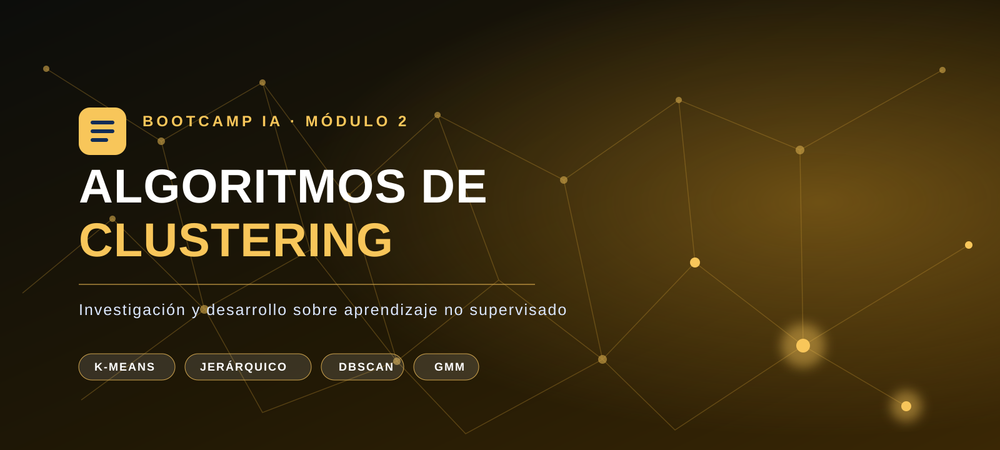

<div align="center">



# Investigación y Desarrollo sobre Algoritmos de Clustering

### Parte 1 · Algoritmos no supervisados de clustering


---

**Bootcamp de Inteligencia Artificial · Módulo 2 · Tarea 5**

</div>

## Ficha de la entrega

| Elemento | Alcance |
| :--- | :--- |
| **Asignatura** | Bootcamp de Inteligencia Artificial · Módulo 2 |
| **Actividad** | Tarea 5 · Investigación y desarrollo sobre algoritmos de clustering |
| **Modalidad** | Investigación teórica con formulación matemática, visualizaciones y código reproducible opcional |
| **Objetivo** | Explicar cómo se descubren estructuras en datos sin etiquetas y cuándo conviene cada enfoque |
| **Estado** | Completada |

> [!NOTE]
> **Criterio de lectura.** Cada agrupamiento debe interpretarse a la luz de los datos, la métrica de similitud y el objetivo del análisis. Un algoritmo no revela por sí solo categorías verdaderas: propone una estructura que debe validarse.

## Propósito de la investigación

Esta investigación estudia cómo funcionan los algoritmos de *clustering*, sus principales tipos, ventajas, desventajas y aplicaciones en el mundo real.

> **Objetivo:** comprender los fundamentos del aprendizaje no supervisado y analizar los distintos enfoques utilizados para descubrir agrupaciones en los datos.

### Cobertura del enunciado

| Requisito solicitado | Desarrollo en este README |
| :--- | :--- |
| Fundamentos del aprendizaje no supervisado | [Sección 1](#1-aprendizaje-no-supervisado-y-algoritmos-de-clustering) |
| Centroides frente a jerárquico | [Sección 2](#2-clustering-basado-en-centroides-y-clustering-jerárquico) |
| Clustering basado en densidad | [Sección 3](#3-clustering-basado-en-densidad-dbscan) |
| Hiperparámetros y evaluación | [Sección 4](#4-elección-de-hiperparámetros-y-evaluación-del-agrupamiento) |
| K-Means, aglomerativo, DBSCAN y GMM | [Sección 5](#5-algoritmos-principales-de-clustering) |

## Índice

1. [Aprendizaje no supervisado y algoritmos de clustering](#1-aprendizaje-no-supervisado-y-algoritmos-de-clustering)
2. [Clustering basado en centroides y clustering jerárquico](#2-clustering-basado-en-centroides-y-clustering-jerárquico)
3. [Clustering basado en densidad: DBSCAN](#3-clustering-basado-en-densidad-dbscan)
4. [Elección de hiperparámetros y evaluación del agrupamiento](#4-elección-de-hiperparámetros-y-evaluación-del-agrupamiento)
5. [Algoritmos principales de clustering](#5-algoritmos-principales-de-clustering)

---

## 1. Aprendizaje no supervisado y algoritmos de clustering

### Preguntas de investigación

- ¿Qué es el aprendizaje no supervisado?
- ¿Qué es un algoritmo de *clustering*?
- ¿En qué se diferencia del aprendizaje supervisado?
- ¿Cuál es su propósito?

### 1.1. Aprendizaje no supervisado

El **aprendizaje no supervisado** es una rama del aprendizaje automático en la que el modelo recibe observaciones, pero **no conoce una respuesta correcta asociada a cada una**. En lugar de aprender a predecir una etiqueta ya definida, busca estructura en los datos: grupos, patrones frecuentes, relaciones, componentes latentes o casos inusuales.

Si el conjunto de datos es

$$
\mathcal{D}=\{\mathbf{x}^{(1)},\mathbf{x}^{(2)},\ldots,\mathbf{x}^{(n)}\},
\qquad \mathbf{x}^{(i)} \in \mathbb{R}^{p},
$$

cada observación $\mathbf{x}^{(i)}$ tiene $p$ características, pero no dispone de una variable objetivo $y^{(i)}$. El análisis parte de una pregunta exploratoria: **«¿qué organización interna sugieren los propios datos?»**

Por ejemplo, una tienda puede registrar para cada cliente su frecuencia de compra, gasto medio y categoría favorita, sin saber de antemano si pertenece al segmento «ocasional», «premium» o «sensible a ofertas». Un método no supervisado puede revelar segmentos con comportamientos parecidos; después, una persona interpreta y nombra esos grupos.

> **Idea clave:** los datos no traen la respuesta; el algoritmo propone una estructura que debe ser analizada y validada.

### 1.2. Algoritmos de clustering

Un algoritmo de **clustering** (o agrupamiento) es un método no supervisado que organiza las observaciones en grupos llamados *clusters*. Busca que los elementos de un mismo grupo sean más similares entre sí que respecto a los elementos de otros grupos, según una medida de similitud o distancia adecuada al problema.

En un agrupamiento «duro» con $K$ grupos, el resultado puede expresarse mediante una función:

$$
c: \mathbf{x}^{(i)} \longmapsto \{1,2,\ldots,K\},
$$

donde $c(\mathbf{x}^{(i)})$ asigna cada observación a un único cluster. La noción de «parecido» no es universal: puede medirse con distancia euclídea entre variables numéricas, similitud coseno entre textos vectorizados o una distancia diseñada para datos de otro tipo. Elegirla bien es parte esencial del problema.

En términos generales, se persiguen dos propiedades:

| Dentro de cada cluster | Entre clusters |
| :--- | :--- |
| **Alta cohesión:** los puntos son parecidos o están próximos. | **Alta separación:** los grupos son distinguibles entre sí. |

Un cluster **no es automáticamente una clase real**. El algoritmo detecta regularidades geométricas o estadísticas; corresponde al conocimiento del dominio decidir si esas regularidades tienen significado útil.

<p align="center">
  
</p>

| Lectura del esquema | Significado |
| :--- | :--- |
| **Datos sin etiquetas** | Observaciones descritas por sus características, sin una clase objetivo conocida. |
| **Similitud** | La distancia o medida elegida determina qué observaciones se consideran próximas. |
| **Clusters** | El algoritmo propone grupos con cohesión interna y separación respecto a los demás. |
| **Interpretación** | El conocimiento del dominio convierte los grupos en conclusiones útiles. |

**Ejemplo intuitivo.** Si representamos canciones por rasgos como energía, tempo y acústica, un algoritmo puede reunir canciones similares. Esos grupos podrían interpretarse como estilos de escucha o contextos de uso, pero ningún algoritmo sabe por sí mismo que un grupo debe llamarse «para entrenar».

### 1.3. Diferencias frente al aprendizaje supervisado

En aprendizaje **supervisado**, cada ejemplo sí incluye una respuesta conocida. El conjunto de entrenamiento tiene la forma:

$$
\mathcal{D}_{sup}=\{(\mathbf{x}^{(i)},y^{(i)})\}_{i=1}^{n},
$$

y el modelo aprende una función $f$ que aproxime $y \approx f(\mathbf{x})$. Si $y$ es una categoría se trata de **clasificación**; si es un valor numérico, de **regresión**. Su rendimiento puede comprobarse comparando predicciones con etiquetas reales que el modelo no ha visto.

| Aspecto | Aprendizaje supervisado | Aprendizaje no supervisado / clustering |
| :--- | :--- | :--- |
| Datos de entrada | Características **y etiquetas** conocidas $(X, y)$ | Solo características $X$ |
| Pregunta principal | «¿Qué valor o clase predigo?» | «¿Qué estructura o grupos existen?» |
| Resultado | Predicción de una etiqueta o valor | Asignación a grupos y descripción de patrones |
| Ejemplo | Predecir si un correo es spam | Agrupar correos por temática sin categorías previas |
| Evaluación habitual | Exactitud, F1, error cuadrático, etc. | Cohesión/separación, estabilidad y utilidad para el dominio |

La distinción tiene una consecuencia práctica importante: en clustering no existe normalmente una «solución verdadera» con la que comparar cada punto. Por ello, un resultado debe juzgarse tanto con criterios cuantitativos como con su interpretación y utilidad en el contexto real.

### 1.4. Propósito del clustering

El propósito del clustering es **convertir una colección de datos sin etiquetar en una representación más comprensible y accionable**. Se utiliza principalmente para:

- **Explorar y entender datos:** detectar patrones o subpoblaciones antes de formular hipótesis.
- **Segmentar:** agrupar clientes, pacientes, productos, documentos o imágenes según características similares.
- **Resumir:** representar miles de observaciones mediante unos pocos perfiles o grupos.
- **Apoyar decisiones posteriores:** usar los grupos para personalización, análisis científico, detección de comportamiento atípico o como paso previo a otro modelo.

| Aplicación real | Observaciones agrupadas | Valor aportado |
| :--- | :--- | :--- |
| Marketing | Clientes según comportamiento de compra | Campañas y recomendaciones más relevantes |
| Salud e investigación | Pacientes según variables clínicas o biomarcadores | Identificación de subgrupos para estudiar con mayor detalle |
| Procesamiento de texto | Noticias, reseñas o documentos según su contenido | Organización temática y sistemas de búsqueda |
| Ciberseguridad | Sesiones o eventos de red según su comportamiento | Identificación de perfiles inusuales para su revisión |

El clustering es especialmente útil cuando las etiquetas son inexistentes, costosas de obtener o demasiado simplificadoras. Sin embargo, no demuestra causalidad ni descubre por sí mismo categorías «naturales»: el resultado depende de los datos, su preparación, la medida de similitud, el algoritmo y sus hiperparámetros. Estas decisiones y las métricas para evaluar el agrupamiento se desarrollarán en los apartados siguientes.

### Fuentes

1. scikit-learn developers. [*Unsupervised learning*](https://scikit-learn.org/stable/unsupervised_learning.html) y [*Clustering*](https://scikit-learn.org/stable/modules/clustering.html), documentación oficial.
2. Hastie, T., Tibshirani, R. y Friedman, J. [*The Elements of Statistical Learning*, 2.ª ed.](https://hastie.su.domains/ElemStatLearn/), Springer, 2009. Cap. 14.
3. Jain, A. K. [*Data Clustering: 50 Years Beyond K-Means*](https://doi.org/10.1016/j.patcog.2009.09.011), *Pattern Recognition Letters*, 2010.

---

## 2. Clustering basado en centroides y clustering jerárquico

### La diferencia esencial: una partición frente a una jerarquía

Ambos enfoques agrupan observaciones sin etiquetas, pero construyen el resultado de maneras fundamentalmente distintas:

- El **clustering basado en centroides**, también llamado **particional**, divide los datos directamente en un número fijo de grupos, $K$. Cada grupo se resume mediante un centro representativo, el **centroide**.
- El **clustering jerárquico** construye una estructura de grupos anidados. En su versión aglomerativa, comienza con una observación por grupo y los va fusionando progresivamente; el resultado es un árbol llamado **dendrograma**.

<p align="center">
  
</p>

| Módulo visual | Algoritmo / enfoque | Idea representada |
| :--- | :--- | :--- |
| Superior izquierdo | **K-Means** | Los puntos se organizan alrededor de centroides. |
| Superior derecho | **Jerárquico aglomerativo** | Las fusiones sucesivas forman una estructura en árbol. |
| Inferior izquierdo | **DBSCAN** | Una zona densa conectada constituye un cluster; los puntos aislados son ruido. |
| Inferior derecho | **GMM** | Varios componentes probabilísticos pueden solaparse. |

> **Analogía:** K-Means reparte libros directamente en $K$ estanterías. El método jerárquico primero junta libros muy similares, después agrupa esas colecciones y conserva la historia completa de esas uniones.

### 2.1. Enfoque particional basado en centroides: K-Means

El algoritmo representativo es **K-Means**. Su objetivo es hallar $K$ centroides $\boldsymbol{\mu}_1,\ldots,\boldsymbol{\mu}_K$ y una asignación de cada punto a uno de ellos que minimice la variación interna:

$$
\min_{C_1,\ldots,C_K}
\sum_{k=1}^{K}\sum_{\mathbf{x}_i \in C_k}
\lVert \mathbf{x}_i - \boldsymbol{\mu}_k \rVert^2,
$$

donde $\boldsymbol{\mu}_k$ es la media de los puntos de $C_k$. De forma iterativa, K-Means alterna dos acciones:

1. **Asignación:** cada observación se asigna al centroide más cercano.
2. **Actualización:** cada centroide se recalcula como la media de las observaciones que le han sido asignadas.

El proceso termina cuando las asignaciones o los centroides apenas cambian. Su salida es una **partición plana**: con $K=3$, todos los puntos quedan en uno de tres grupos y el algoritmo no indica que dos de ellos estén más relacionados entre sí que con el tercero.

**Ejemplo.** Una empresa fija $K=4$ para segmentar clientes según gasto anual y número de compras. K-Means devuelve cuatro perfiles con un centroide por perfil; cada cliente queda asignado exactamente a uno de ellos.

**Fortalezas y límites.** Es simple, rápido y escalable para datos numéricos con grupos aproximadamente compactos. A cambio, hay que especificar $K$ de antemano, el resultado puede cambiar con la inicialización y la distancia euclídea favorece grupos de forma aproximadamente esférica y tamaño comparable. Antes de aplicarlo, las variables deben escalarse: de otro modo, una variable medida en miles puede dominar la distancia.

### 2.2. Enfoque jerárquico: clustering aglomerativo

El algoritmo representativo es el **clustering jerárquico aglomerativo**. Comienza con $n$ clusters individuales y fusiona repetidamente el par de clusters más próximo hasta reunirlos todos —o hasta alcanzar el nivel de corte elegido—. A diferencia de K-Means, no necesita centroides para definir cada paso: necesita una regla de **enlace** (*linkage*) que indique cómo medir la distancia entre dos grupos.

| Regla de enlace | Distancia entre dos clusters | Consecuencia habitual |
| :--- | :--- | :--- |
| *Single linkage* | Distancia entre sus puntos más cercanos | Puede captar formas alargadas, pero es sensible al «encadenamiento» por ruido. |
| *Complete linkage* | Distancia entre sus puntos más alejados | Favorece grupos compactos. |
| *Average linkage* | Promedio de todas las distancias entre pares | Ofrece un compromiso entre los dos anteriores. |
| Ward | Aumento de la varianza interna al fusionar | Tiende a grupos compactos; usa distancia euclídea. |

El dendrograma conserva las fusiones y la distancia (o coste) a la que suceden. Al **cortarlo horizontalmente** se decide cuántos clusters se desean: un corte bajo produce muchos grupos pequeños y uno alto produce pocos grupos grandes.

**Ejemplo.** En biología, se pueden agrupar muestras de expresión génica y observar el dendrograma. Si a cierta altura dos ramas se unen, ello señala que sus perfiles son más parecidos entre sí que las ramas que solo se unen a alturas mayores. El investigador puede elegir el nivel de detalle apropiado después de estudiar esa estructura.

**Fortalezas y límites.** Este método resulta muy interpretable porque muestra agrupaciones a distintas escalas y no obliga a fijar $K$ antes de construir el árbol. Sin embargo, suele ser más costoso en memoria y tiempo que K-Means en conjuntos grandes; además, las fusiones aglomerativas son irreversibles y el resultado depende de la métrica y del enlace elegidos. Un enlace inadecuado puede unir prematuramente grupos que deberían permanecer separados.

### 2.3. Comparación directa y criterio de elección

| Criterio | Centroides / K-Means | Jerárquico aglomerativo |
| :--- | :--- | :--- |
| Estructura resultante | Una única partición plana de $K$ grupos | Jerarquía de grupos anidados (dendrograma) |
| Decisión sobre $K$ | Se toma **antes** de ejecutar el algoritmo | Puede tomarse **después**, al cortar el árbol |
| Representación del grupo | Centroide (media) | Relación entre observaciones y fusiones |
| Decisión local | Punto → centroide más cercano | Par de clusters → fusión según el enlace |
| Escalabilidad | Habitualmente buena en grandes conjuntos numéricos | Más limitada; apropiada para tamaños pequeños o medios |
| Sensibilidad principal | Inicialización, $K$, escala de variables y valores atípicos | Métrica, regla de enlace, ruido y fusiones tempranas |
| Cuándo elegirlo | Se busca una segmentación única, rápida y operativa | Interesa explorar relaciones a varios niveles o justificar el número de grupos visualmente |

En resumen, **K-Means responde «¿cómo divido los datos en exactamente $K$ grupos compactos?»**, mientras que el jerárquico responde **«¿cómo se organizan las similitudes desde el nivel más fino hasta el más general?»**. Ninguno es universalmente mejor: la elección depende de la geometría de los datos, su tamaño y la necesidad —o no— de interpretar una estructura multinivel.

### Fuentes

1. scikit-learn developers. [*Clustering*](https://scikit-learn.org/stable/modules/clustering.html), documentación oficial: K-Means, clustering jerárquico y reglas de enlace.
2. MacQueen, J. B. [*Some Methods for Classification and Analysis of Multivariate Observations*](https://projecteuclid.org/euclid.bsmsp/1200512992), 1967. Introduce K-Means.
3. Murtagh, F. y Contreras, P. [*Algorithms for Hierarchical Clustering: An Overview*](https://doi.org/10.1002/widm.1214), *WIREs Data Mining and Knowledge Discovery*, 2017.

---

## 3. Clustering basado en densidad: DBSCAN

### Idea central: los clusters son regiones densas separadas por zonas vacías

El **clustering basado en densidad** define un cluster como una región del espacio donde los datos se concentran, separada de otras regiones por zonas de baja densidad. Su algoritmo más representativo es **DBSCAN** (*Density-Based Spatial Clustering of Applications with Noise*).

En lugar de buscar un centro de cada grupo o construir un árbol de fusiones, DBSCAN responde a una pregunta local: **«¿hay suficientes observaciones cerca de este punto?»**. Si existen zonas densas conectadas entre sí, forman un cluster; si una observación queda alejada de toda zona densa, se marca como ruido o valor atípico.

<p align="center">
  
</p>

| Elemento del esquema | Lectura correcta |
| :--- | :--- |
| **Región central densa** | Representa los puntos conectados por densidad que forman un cluster. |
| **Contorno discontinuo** | Visualiza el vecindario definido por el radio $\varepsilon$. |
| **Puntos aislados** | Son candidatos a ruido cuando no pertenecen al vecindario de ningún punto núcleo. |

### 3.1. Los conceptos y los hiperparámetros de DBSCAN

DBSCAN se apoya en dos hiperparámetros:

| Hiperparámetro | Significado | Efecto al aumentarlo |
| :--- | :--- | :--- |
| $\varepsilon$ (*eps*) | Radio máximo del vecindario de un punto | Se conectan puntos más alejados; los clusters pueden crecer o fusionarse. |
| $\text{MinPts}$ (*min_samples*) | Número mínimo de puntos del vecindario para considerar una zona densa | Exige mayor densidad; crece el número de puntos clasificados como ruido. |

Para una distancia $d$, el vecindario de radio $\varepsilon$ de un punto $\mathbf{x}$ es:

$$
N_{\varepsilon}(\mathbf{x}) = \{\mathbf{y} \in \mathcal{D} \mid d(\mathbf{x},\mathbf{y}) \leq \varepsilon\}.
$$

Con la convención habitual de incluir el propio punto, DBSCAN clasifica cada observación como:

- **Punto núcleo:** $|N_{\varepsilon}(\mathbf{x})| \geq \text{MinPts}$. Está en una región suficientemente densa.
- **Punto frontera:** no es núcleo, pero se encuentra dentro del vecindario de un punto núcleo. Se asigna al cluster, aunque no puede expandirlo.
- **Ruido (*noise* u *outlier*):** no es núcleo ni frontera; DBSCAN le asigna la etiqueta `-1` en implementaciones como scikit-learn.

> El criterio de vecindad depende de la distancia elegida. Por eso es imprescindible **escalar las variables** cuando sus unidades son diferentes; de lo contrario, $\varepsilon$ no tendrá una interpretación coherente.

### 3.2. Mecanismo de funcionamiento

De forma simplificada, DBSCAN recorre los puntos aún no visitados:

1. Calcula el vecindario de radio $\varepsilon$ del punto actual.
2. Si no alcanza `MinPts`, lo deja provisionalmente como ruido.
3. Si es un punto núcleo, crea un cluster y añade todos sus vecinos.
4. Cuando entre los vecinos aparece otro núcleo, también incorpora sus vecinos. Esta expansión continúa mientras existan núcleos conectados por densidad.
5. Los puntos que nunca quedan conectados a un núcleo permanecen como ruido.

El término importante es **conectividad por densidad**: dos zonas forman un mismo cluster si es posible recorrerlas mediante una cadena de puntos núcleo vecinos. Así, DBSCAN puede seguir curvas o contornos complejos sin tener que aproximarlos mediante un centro.

### 3.3. Diferencias frente a centroides y jerárquico

| Aspecto | Basado en centroides — K-Means | Jerárquico aglomerativo | Basado en densidad — DBSCAN |
| :--- | :--- | :--- | :--- |
| Idea de cluster | Puntos próximos a una media o centroide | Grupos unidos progresivamente según un enlace | Región densa conectada con otras regiones densas |
| Forma esperada | Aproximadamente compacta o esférica | Depende del enlace; puede mostrar relaciones a varias escalas | Puede ser irregular, curvada o alargada |
| Número de grupos | Debe fijarse $K$ antes de ejecutar | Se elige el corte del dendrograma | **No se especifica $K$**; emerge de $\varepsilon$ y `MinPts` |
| Valores atípicos | Se fuerzan a pertenecer a algún cluster | Normalmente se integran en alguna fusión | Puede identificarlos explícitamente como ruido |
| Parámetros decisivos | $K$, inicialización y escala | Métrica, enlace y nivel de corte | $\varepsilon$, `MinPts`, métrica y escala |
| Salida | Partición plana de todos los puntos | Dendrograma y partición al cortarlo | Partición plana parcial: clusters + posible ruido |

La diferencia conceptual puede resumirse así:

- **K-Means** pregunta: «¿cuál es el centro más cercano a cada punto?».
- **Jerárquico aglomerativo** pregunta: «¿qué dos grupos deberían fusionarse ahora?».
- **DBSCAN** pregunta: «¿qué puntos pertenecen a la misma región suficientemente densa?».

### 3.4. Cuándo usar DBSCAN, ventajas y limitaciones

DBSCAN es una buena elección cuando se esperan grupos de formas no convexas y se desea separar los valores atípicos. Por ejemplo, permite identificar zonas de concentración en coordenadas GPS de taxis, detectar agrupaciones de eventos en redes o descubrir grupos espaciales de galaxias, sin obligar a que todos los puntos pertenezcan a un segmento.

| Ventajas | Limitaciones |
| :--- | :--- |
| No requiere indicar el número de clusters. | La elección de $\varepsilon$ es muy sensible y depende de la escala y de la métrica. |
| Detecta clusters de formas arbitrarias. | Un único $\varepsilon$ funciona mal si los clusters tienen densidades muy distintas. |
| Identifica ruido de manera explícita. | La distancia pierde capacidad discriminativa en muchas dimensiones; suele requerir reducción de dimensionalidad o una métrica adecuada. |
| No necesita inicialización aleatoria de centroides. | Puede requerir recursos considerables en conjuntos muy grandes, según la implementación y la estructura de vecindad. |

Un criterio práctico es usar DBSCAN tras normalizar los datos y analizar la distancia al $k$-ésimo vecino más cercano, tomando $k \approx \text{MinPts}$. La «rodilla» de esa gráfica puede sugerir un valor inicial de $\varepsilon$, pero no sustituye la validación con conocimiento del dominio y métricas de calidad. Las métricas de evaluación se tratarán de forma específica en el punto 4.

### Fuentes

1. scikit-learn developers. [*DBSCAN y clustering basado en densidad*](https://scikit-learn.org/stable/modules/clustering.html#dbscan), documentación oficial.
2. Ester, M., Kriegel, H.-P., Sander, J. y Xu, X. [*A Density-Based Algorithm for Discovering Clusters in Large Spatial Databases with Noise*](https://www.aaai.org/Papers/KDD/1996/KDD96-037.pdf), KDD, 1996.
3. Schubert, E., Sander, J., Ester, M., Kriegel, H.-P. y Xu, X. [*DBSCAN Revisited, Revisited: Why and How You Should (Still) Use DBSCAN*](https://doi.org/10.1145/3068335), *ACM Transactions on Database Systems*, 2017.

---

## 4. Elección de hiperparámetros y evaluación del agrupamiento

### Elegir parámetros es elegir la historia que cuentan los datos

Un algoritmo de clustering no «descubre» grupos de manera totalmente automática: sus hiperparámetros determinan qué patrón considera un grupo. Elegirlos mal puede fusionar poblaciones que son distintas, fragmentar una misma población en partes artificiales o confundir ruido con estructura.

Por ejemplo, al aplicar K-Means a clientes de una tienda, $K=2$ podría mezclar compradores frecuentes con compradores de gasto alto; $K=10$ podría crear segmentos demasiado pequeños y poco accionables. Con DBSCAN, un $\varepsilon$ demasiado grande conecta regiones que deberían permanecer separadas, mientras que uno demasiado pequeño convierte muchos puntos en ruido. Por eso, el «mejor» resultado no es necesariamente el que devuelve más clusters ni el que optimiza una sola cifra: debe ser **coherente, estable e interpretable**.

| Algoritmo | Decisiones que cambian el agrupamiento | Riesgo si se eligen mal |
| :--- | :--- | :--- |
| K-Means | Número de clusters $K$, inicialización y escalado | Grupos fusionados o fragmentados; solución local desfavorable. |
| Jerárquico | Métrica, enlace y altura de corte | Fusiones tempranas irreversibles o partición poco útil. |
| DBSCAN | $\varepsilon$, `MinPts` y métrica | Clusters artificialmente unidos, exceso de ruido o pérdida de grupos reales. |

<p align="center">
  
</p>

| Evidencia de validación | Pregunta que responde |
| :--- | :--- |
| **Método del codo** | ¿A partir de qué valor de $K$ la mejora de la inercia deja de compensar? |
| **Coeficiente de silueta** | ¿Los puntos están más cohesionados con su propio grupo que con los grupos vecinos? |
| **Criterio de dominio** | ¿El resultado es estable, interpretable y útil para el problema real? |

### 4.1. Método del codo

El **método del codo** se usa principalmente con K-Means para comparar distintos valores de $K$. Para cada valor se calcula la **inercia**, también llamada suma de cuadrados dentro de los clusters (*WCSS*, *Within-Cluster Sum of Squares*):

$$
\text{Inercia}(K) = \sum_{k=1}^{K}\sum_{\mathbf{x}_i \in C_k}
\lVert \mathbf{x}_i - \boldsymbol{\mu}_k \rVert^2.
$$

La inercia siempre disminuye —o se mantiene— al aumentar $K$, porque cada centroide adicional da más capacidad para ajustarse a los datos. El objetivo no es buscar el mínimo absoluto, que ocurriría cuando cada punto fuese un cluster, sino encontrar el punto a partir del cual añadir más grupos apenas reduce la inercia: el **codo**.

| $K$ probado | Inercia de ejemplo | Lectura |
| :---: | :---: | :--- |
| 1 | 1 200 | Un único grupo explica muy mal la variabilidad. |
| 2 | 720 | Mejora grande. |
| 3 | 410 | Mejora grande. |
| 4 | 330 | Mejora apreciable. |
| 5 | 295 | La mejora comienza a ser menor. |
| 6 | 275 | Ganancia marginal. |

En el ejemplo, $K=4$ sería un candidato razonable, no una decisión automática. Debe contrastarse con la utilidad de interpretar cuatro segmentos frente a tres o cinco.

**Ventajas.** Es sencillo, visual y rápido de calcular si ya se ejecuta K-Means.

**Limitaciones.** El codo puede ser difuso o no existir; la inercia solo es comparable en el mismo conjunto y con la misma representación de datos; además, está alineada con el supuesto de grupos compactos de K-Means. Por tanto, no es el método adecuado como criterio único para DBSCAN ni garantiza que la segmentación tenga significado de negocio o científico.

### 4.2. Coeficiente de silueta

El **coeficiente de silueta** evalúa simultáneamente la cohesión interna y la separación. Para un punto $i$:

- $a(i)$ es la distancia media entre $i$ y los demás puntos de su propio cluster.
- $b(i)$ es la menor distancia media entre $i$ y cualquier otro cluster; es decir, la distancia al cluster vecino más cercano.

Su silueta individual es:

$$
s(i) = \frac{b(i) - a(i)}{\max\{a(i), b(i)\}}.
$$

La silueta global es la media de $s(i)$ para todas las observaciones y toma valores entre $-1$ y $1$.

| Valor de $s(i)$ | Interpretación |
| :---: | :--- |
| Cercano a $+1$ | El punto está bien integrado en su cluster y lejos de los demás. |
| Cercano a $0$ | El punto está en la frontera entre dos clusters. |
| Menor que $0$ | El punto podría encajar mejor en otro cluster. |

Para elegir $K$ con K-Means, se calcula la silueta media para varios valores y se prefieren valores altos, examinando también el gráfico de siluetas por cluster. Un promedio alto con un grupo diminuto o con muchos valores negativos merece revisión: el promedio puede ocultar problemas locales.

**Ventajas.** No depende del algoritmo usado, incorpora cohesión y separación, y permite inspeccionar tanto cada punto como el promedio global.

**Limitaciones.** Requiere elegir una métrica de distancia apropiada; puede favorecer grupos compactos y bien separados frente a estructuras complejas; y su cálculo puede ser costoso en conjuntos muy grandes. Debe aplicarse solo cuando hay al menos dos clusters y tratar el ruido de DBSCAN con cuidado —normalmente se evalúan los puntos no etiquetados como ruido por separado—.

### 4.3. No decidir con una sola métrica: estabilidad y conocimiento del dominio

El codo y la silueta son **métricas internas**: evalúan la estructura usando únicamente los datos y el resultado del algoritmo. Son muy útiles cuando no hay etiquetas, pero no sustituyen el juicio del problema. Una buena práctica consiste en combinar evidencias:

1. **Calidad interna:** contrastar inercia, silueta u otra métrica compatible con la geometría esperada.
2. **Estabilidad:** repetir el proceso con distintas semillas, subconjuntos o pequeñas perturbaciones. Si los grupos cambian radicalmente, la conclusión es frágil.
3. **Interpretabilidad:** comprobar que los perfiles resultantes son distinguibles y útiles para el objetivo. Cuatro segmentos de clientes deben describir comportamientos diferentes que permitan tomar decisiones reales.
4. **Validación externa, si existen etiquetas de referencia:** comparar el resultado con ellas mediante métricas como el *Adjusted Rand Index* (ARI). Estas etiquetas sirven para validar, no para entrenar el clustering.

> **Regla práctica:** primero se seleccionan varios candidatos mediante métricas; después se elige la solución más estable y útil para el contexto. La métrica no reemplaza el criterio experto.

### 4.4. Ejemplo reproducible en Python

El siguiente código compara varios valores de $K$ mediante inercia y silueta. Se presupone que `X_scaled` contiene las variables ya normalizadas.

```python
from sklearn.cluster import KMeans
from sklearn.metrics import silhouette_score

resultados = []

for k in range(2, 9):
    modelo = KMeans(n_clusters=k, init="k-means++", n_init=20, random_state=42)
    etiquetas = modelo.fit_predict(X_scaled)

    resultados.append({
        "k": k,
        "inercia": modelo.inertia_,
        "silueta": silhouette_score(X_scaled, etiquetas),
    })

for resultado in resultados:
    print(resultado)
```

La elección final debe combinar la curva de inercia, el mayor valor de silueta que sea interpretable y el objetivo del caso de uso. En especial, no se debe seleccionar $K$ únicamente porque produzca el máximo numérico si ello genera segmentos sin sentido práctico.

### Fuentes

1. scikit-learn developers. [*Clustering performance evaluation*](https://scikit-learn.org/stable/modules/clustering.html#clustering-performance-evaluation) y [*Silhouette analysis on K-Means*](https://scikit-learn.org/stable/auto_examples/cluster/plot_kmeans_silhouette_analysis.html), documentación oficial.
2. Rousseeuw, P. J. [*Silhouettes: A Graphical Aid to the Interpretation and Validation of Cluster Analysis*](https://doi.org/10.1016/0377-0427(87)90125-7), *Journal of Computational and Applied Mathematics*, 1987.
3. Kaufman, L. y Rousseeuw, P. J. [*Finding Groups in Data: An Introduction to Cluster Analysis*](https://doi.org/10.1002/9780470316801), Wiley, 2005.

---

## 5. Algoritmos principales de clustering

Esta sección reúne los cuatro algoritmos centrales de la investigación. Todos buscan agrupar datos sin etiquetas, pero no comparten la misma definición de «grupo»: pueden basarse en proximidad a un centro, relaciones jerárquicas, densidad local o un modelo probabilístico.

### 5.1. K-Means

**Qué es.** K-Means es un algoritmo particional que divide los datos en $K$ grupos alrededor de sus centroides. Su objetivo es minimizar la distancia cuadrática entre cada punto y el centroide del grupo al que se asigna.

**Mecanismo.** Primero inicializa $K$ centroides —preferiblemente con `k-means++`—; después alterna entre asignar cada observación al centroide más cercano y recalcular cada centroide como la media de los puntos asignados. Se detiene cuando las asignaciones dejan de cambiar de forma relevante.

| Ventajas | Desventajas | Casos de uso comunes |
| :--- | :--- | :--- |
| Rápido, simple y escalable en datos numéricos. | Obliga a fijar $K$; es sensible a la inicialización y a valores atípicos. | Segmentación de clientes, agrupación de productos y compresión o cuantización de imágenes. |
| Sus centroides permiten describir cada grupo con claridad. | Favorece grupos compactos; funciona peor con formas curvas, densidades o tamaños muy distintos. | Creación de perfiles de uso, análisis exploratorio y preprocesamiento. |

**Cuándo elegirlo.** Cuando se necesita una partición rápida y operativa, los datos son principalmente numéricos y escalados, y se espera que los grupos sean relativamente compactos. El número $K$ debe justificarse con el codo, silueta y conocimiento del dominio.

### 5.2. Clustering jerárquico aglomerativo

**Qué es.** Es un método *bottom-up* que comienza con un cluster por observación y fusiona los dos clusters más próximos en cada iteración. El resultado es un **dendrograma**, un árbol que conserva la estructura de agrupación a diferentes niveles.

**Mecanismo.** La noción de «dos clusters más próximos» depende del enlace elegido: *single*, *complete*, *average* o Ward. Al cortar el dendrograma a una determinada altura se obtiene una partición final; no hace falta fijar el número de clusters antes de construir el árbol.

| Ventajas | Desventajas | Casos de uso comunes |
| :--- | :--- | :--- |
| Muy interpretable: muestra relaciones a varios niveles de detalle. | Mayor coste de tiempo y memoria que K-Means para conjuntos grandes. | Taxonomías, análisis de expresión génica y estudio de similitud entre muestras biológicas. |
| Permite escoger el nivel de corte después de observar la jerarquía. | Las fusiones son irreversibles y dependen mucho de la métrica y del enlace. | Agrupación de documentos, análisis exploratorio de segmentos y construcción de dendrogramas. |

**Cuándo elegirlo.** Cuando importa entender qué grupos están relacionados entre sí o explorar varias granularidades, especialmente en conjuntos pequeños o medianos. Conviene inspeccionar el dendrograma y contrastar varios enlaces.

### 5.3. DBSCAN

**Qué es.** DBSCAN es un algoritmo basado en densidad: un cluster es una región con muchos puntos conectados entre sí, separada de otras regiones por zonas poco pobladas. Identifica explícitamente observaciones que no pertenecen a ninguna región densa como ruido.

**Mecanismo.** Define un radio de vecindad $\varepsilon$ y un mínimo de vecinos `MinPts`. Un punto con suficientes vecinos es núcleo; sus vecinos y los núcleos alcanzables por densidad expanden el cluster. Los puntos cercanos a un núcleo, pero sin densidad suficiente, son frontera; los aislados quedan como ruido.

| Ventajas | Desventajas | Casos de uso comunes |
| :--- | :--- | :--- |
| No necesita especificar $K$ y detecta ruido de forma nativa. | Elegir $\varepsilon$ y `MinPts` es sensible a la escala, métrica y dimensionalidad. | Agrupación de coordenadas GPS, localización de zonas de actividad y análisis espacial. |
| Encuentra grupos no convexos: anillos, trayectorias o formas curvas. | Un único nivel de densidad falla si los clusters tienen densidades muy diferentes. | Detección de anomalías, agrupación de eventos de red y análisis de datos geográficos. |

**Cuándo elegirlo.** Cuando se esperan formas irregulares, existen valores atípicos relevantes y no se conoce $K$. No suele ser la primera opción con datos de muy alta dimensión o densidades muy heterogéneas; en ese caso pueden evaluarse alternativas como OPTICS o HDBSCAN.

### 5.4. Gaussian Mixture Models (GMM)

**Qué es.** Un GMM es un modelo probabilístico que supone que los datos proceden de una mezcla de $K$ distribuciones gaussianas. A diferencia de K-Means, no se limita a asignar cada punto a un único grupo: calcula la probabilidad de pertenencia de cada punto a cada componente, por lo que realiza **clustering suave**.

La densidad modelada es:

$$
p(\mathbf{x}) = \sum_{k=1}^{K} \pi_k\, \mathcal{N}(\mathbf{x} \mid \boldsymbol{\mu}_k, \boldsymbol{\Sigma}_k),
\qquad \sum_{k=1}^{K}\pi_k = 1,
$$

donde $\pi_k$ es el peso de la componente, $\boldsymbol{\mu}_k$ su media y $\boldsymbol{\Sigma}_k$ su matriz de covarianza. La covarianza permite que los grupos sean elípticos, orientados y de tamaños diferentes.

**Mecanismo.** Habitualmente se ajusta con el algoritmo **EM** (*Expectation-Maximization*): en el paso E calcula las probabilidades de pertenencia (*responsibilities*) con los parámetros actuales; en el paso M actualiza pesos, medias y covarianzas para maximizar la verosimilitud. Se repite hasta converger. Si se necesita una etiqueta única, se asigna la componente de mayor probabilidad.

| Ventajas | Desventajas | Casos de uso comunes |
| :--- | :--- | :--- |
| Expresa incertidumbre y permite solapamiento entre grupos. | Hay que fijar el número de componentes y suele ser sensible a inicialización y máximos locales. | Segmentación de clientes con perfiles solapados y análisis de poblaciones en biomedicina. |
| Modela clusters elípticos mediante la covarianza y estima densidades. | Supone una forma gaussiana; puede requerir mucha información para estimar covarianzas completas. | Modelado de distribuciones, detección probabilística de anomalías y reconocimiento de patrones. |

**Cuándo elegirlo.** Cuando los clusters se solapan, la incertidumbre importa o la geometría es aproximadamente elíptica. El número de componentes puede compararse con AIC o BIC, además de la silueta y de la interpretación. En el caso particular de covarianzas esféricas e iguales y asignaciones duras, K-Means puede entenderse como una aproximación más restrictiva de esta idea.

### 5.5. Comparativa y guía de selección

| Algoritmo | Representación del cluster | ¿Hay que fijar $K$? | ¿Admite ruido explícito? | Forma que maneja mejor | Tipo de asignación |
| :--- | :--- | :---: | :---: | :--- | :--- |
| K-Means | Centroide | Sí | No | Compacta, aproximadamente esférica | Dura |
| Jerárquico aglomerativo | Ramas de un dendrograma | No al inicio | No, salvo tratamiento adicional | Depende del enlace y la métrica | Dura al elegir el corte |
| DBSCAN | Región densa conectada | No | Sí | Irregular y no convexa | Dura, con etiqueta de ruido |
| GMM | Componente gaussiana con media y covarianza | Sí, componentes | No de forma nativa | Elíptica; puede solaparse | Suave (probabilística) |

La siguiente guía resume una elección inicial razonable, que siempre debe validarse con el punto 4:

- **Necesitas rapidez y perfiles simples:** empieza por K-Means.
- **Necesitas una explicación visual de las relaciones entre grupos:** usa jerárquico aglomerativo.
- **Hay ruido relevante o formas complejas:** prueba DBSCAN.
- **Los grupos se solapan y la incertidumbre es informativa:** utiliza GMM.

No existe un algoritmo ganador para todos los datos. La decisión correcta combina geometría, escala, tipo de variables, volumen de datos, presencia de ruido y finalidad del análisis.

### Fuentes

1. scikit-learn developers. [*Clustering*](https://scikit-learn.org/stable/modules/clustering.html) y [*Gaussian mixture models*](https://scikit-learn.org/stable/modules/mixture.html), documentación oficial.
2. MacQueen, J. B. [*Some Methods for Classification and Analysis of Multivariate Observations*](https://projecteuclid.org/euclid.bsmsp/1200512992), 1967.
3. Ester, M., Kriegel, H.-P., Sander, J. y Xu, X. [*A Density-Based Algorithm for Discovering Clusters in Large Spatial Databases with Noise*](https://www.aaai.org/Papers/KDD/1996/KDD96-037.pdf), KDD, 1996.
4. Dempster, A. P., Laird, N. M. y Rubin, D. B. [*Maximum Likelihood from Incomplete Data via the EM Algorithm*](https://doi.org/10.1111/j.2517-6161.1977.tb01600.x), *Journal of the Royal Statistical Society: Series B*, 1977.

---

<div align="center">

<sub>Investigación académica sobre algoritmos de clustering</sub>

</div>
