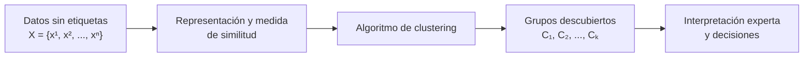
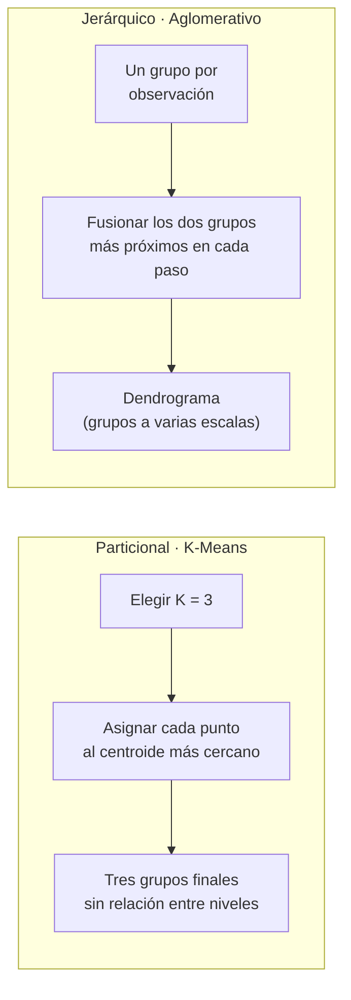
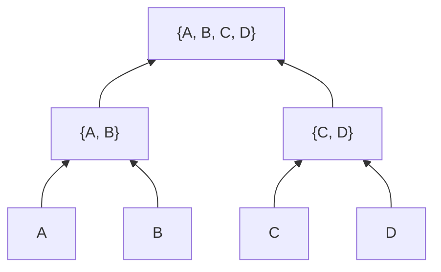
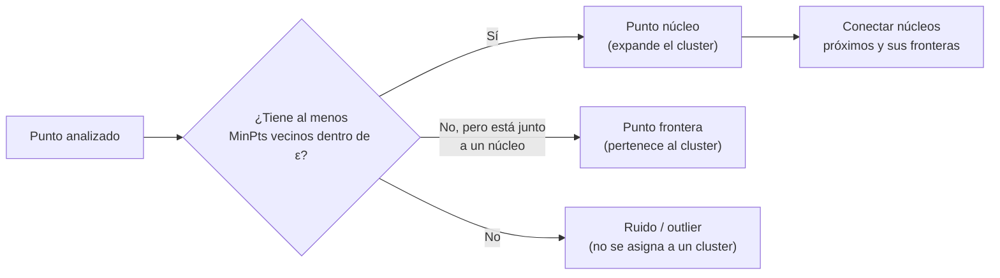
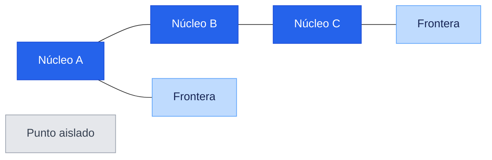

# Investigación y Desarrollo sobre Algoritmos de Clustering

### Parte 1 · Algoritmos no supervisados de clustering

---

**Bootcamp de Inteligencia Artificial · Módulo 2 · Tarea 5**

## Descripción

Esta investigación estudia cómo funcionan los algoritmos de *clustering*, sus principales tipos, ventajas, desventajas y aplicaciones en el mundo real.

> **Objetivo:** comprender los fundamentos del aprendizaje no supervisado y analizar los distintos enfoques utilizados para descubrir agrupaciones en los datos.

## Índice

1. [Aprendizaje no supervisado y algoritmos de clustering](#1-aprendizaje-no-supervisado-y-algoritmos-de-clustering)
2. [Clustering basado en centroides y clustering jerárquico](#2-clustering-basado-en-centroides-y-clustering-jerárquico)
3. [Clustering basado en densidad: DBSCAN](#3-clustering-basado-en-densidad-dbscan)

---

## 1. Aprendizaje no supervisado y algoritmos de clustering

### Preguntas de investigación

- ¿Qué es el aprendizaje no supervisado?
- ¿Qué es un algoritmo de *clustering*?
- ¿En qué se diferencia del aprendizaje supervisado?
- ¿Cuál es su propósito?

### 1.1. Aprendizaje no supervisado

El **aprendizaje no supervisado** es una rama del aprendizaje automático en la que el modelo recibe observaciones, pero **no conoce una respuesta correcta asociada a cada una**. En lugar de aprender a predecir una etiqueta ya definida, busca estructura en los datos: grupos, patrones frecuentes, relaciones, componentes latentes o casos inusuales.

Si el conjunto de datos es

$$
\mathcal{D}=\{\mathbf{x}^{(1)},\mathbf{x}^{(2)},\ldots,\mathbf{x}^{(n)}\},
\qquad \mathbf{x}^{(i)} \in \mathbb{R}^{p},
$$

cada observación $\mathbf{x}^{(i)}$ tiene $p$ características, pero no dispone de una variable objetivo $y^{(i)}$. El análisis parte de una pregunta exploratoria: **«¿qué organización interna sugieren los propios datos?»**

Por ejemplo, una tienda puede registrar para cada cliente su frecuencia de compra, gasto medio y categoría favorita, sin saber de antemano si pertenece al segmento «ocasional», «premium» o «sensible a ofertas». Un método no supervisado puede revelar segmentos con comportamientos parecidos; después, una persona interpreta y nombra esos grupos.

> **Idea clave:** los datos no traen la respuesta; el algoritmo propone una estructura que debe ser analizada y validada.

### 1.2. Algoritmos de clustering

Un algoritmo de **clustering** (o agrupamiento) es un método no supervisado que organiza las observaciones en grupos llamados *clusters*. Busca que los elementos de un mismo grupo sean más similares entre sí que respecto a los elementos de otros grupos, según una medida de similitud o distancia adecuada al problema.

En un agrupamiento «duro» con $K$ grupos, el resultado puede expresarse mediante una función:

$$
c: \mathbf{x}^{(i)} \longmapsto \{1,2,\ldots,K\},
$$

donde $c(\mathbf{x}^{(i)})$ asigna cada observación a un único cluster. La noción de «parecido» no es universal: puede medirse con distancia euclídea entre variables numéricas, similitud coseno entre textos vectorizados o una distancia diseñada para datos de otro tipo. Elegirla bien es parte esencial del problema.

En términos generales, se persiguen dos propiedades:

| Dentro de cada cluster | Entre clusters |
| :--- | :--- |
| **Alta cohesión:** los puntos son parecidos o están próximos. | **Alta separación:** los grupos son distinguibles entre sí. |

Un cluster **no es automáticamente una clase real**. El algoritmo detecta regularidades geométricas o estadísticas; corresponde al conocimiento del dominio decidir si esas regularidades tienen significado útil.

**Ejemplo intuitivo.** Si representamos canciones por rasgos como energía, tempo y acústica, un algoritmo puede reunir canciones similares. Esos grupos podrían interpretarse como estilos de escucha o contextos de uso, pero ningún algoritmo sabe por sí mismo que un grupo debe llamarse «para entrenar».

### 1.3. Diferencias frente al aprendizaje supervisado

En aprendizaje **supervisado**, cada ejemplo sí incluye una respuesta conocida. El conjunto de entrenamiento tiene la forma:

$$
\mathcal{D}_{sup}=\{(\mathbf{x}^{(i)},y^{(i)})\}_{i=1}^{n},
$$

y el modelo aprende una función $f$ que aproxime $y \approx f(\mathbf{x})$. Si $y$ es una categoría se trata de **clasificación**; si es un valor numérico, de **regresión**. Su rendimiento puede comprobarse comparando predicciones con etiquetas reales que el modelo no ha visto.

| Aspecto | Aprendizaje supervisado | Aprendizaje no supervisado / clustering |
| :--- | :--- | :--- |
| Datos de entrada | Características **y etiquetas** conocidas $(X, y)$ | Solo características $X$ |
| Pregunta principal | «¿Qué valor o clase predigo?» | «¿Qué estructura o grupos existen?» |
| Resultado | Predicción de una etiqueta o valor | Asignación a grupos y descripción de patrones |
| Ejemplo | Predecir si un correo es spam | Agrupar correos por temática sin categorías previas |
| Evaluación habitual | Exactitud, F1, error cuadrático, etc. | Cohesión/separación, estabilidad y utilidad para el dominio |

La distinción tiene una consecuencia práctica importante: en clustering no existe normalmente una «solución verdadera» con la que comparar cada punto. Por ello, un resultado debe juzgarse tanto con criterios cuantitativos como con su interpretación y utilidad en el contexto real.

### 1.4. Propósito del clustering

El propósito del clustering es **convertir una colección de datos sin etiquetar en una representación más comprensible y accionable**. Se utiliza principalmente para:

- **Explorar y entender datos:** detectar patrones o subpoblaciones antes de formular hipótesis.
- **Segmentar:** agrupar clientes, pacientes, productos, documentos o imágenes según características similares.
- **Resumir:** representar miles de observaciones mediante unos pocos perfiles o grupos.
- **Apoyar decisiones posteriores:** usar los grupos para personalización, análisis científico, detección de comportamiento atípico o como paso previo a otro modelo.

| Aplicación real | Observaciones agrupadas | Valor aportado |
| :--- | :--- | :--- |
| Marketing | Clientes según comportamiento de compra | Campañas y recomendaciones más relevantes |
| Salud e investigación | Pacientes según variables clínicas o biomarcadores | Identificación de subgrupos para estudiar con mayor detalle |
| Procesamiento de texto | Noticias, reseñas o documentos según su contenido | Organización temática y sistemas de búsqueda |
| Ciberseguridad | Sesiones o eventos de red según su comportamiento | Identificación de perfiles inusuales para su revisión |

El clustering es especialmente útil cuando las etiquetas son inexistentes, costosas de obtener o demasiado simplificadoras. Sin embargo, no demuestra causalidad ni descubre por sí mismo categorías «naturales»: el resultado depende de los datos, su preparación, la medida de similitud, el algoritmo y sus hiperparámetros. Estas decisiones y las métricas para evaluar el agrupamiento se desarrollarán en los apartados siguientes.

### Fuentes

1. scikit-learn developers. [*Unsupervised learning*](https://scikit-learn.org/stable/unsupervised_learning.html) y [*Clustering*](https://scikit-learn.org/stable/modules/clustering.html), documentación oficial.
2. Hastie, T., Tibshirani, R. y Friedman, J. [*The Elements of Statistical Learning*, 2.ª ed.](https://hastie.su.domains/ElemStatLearn/), Springer, 2009. Cap. 14.
3. Jain, A. K. [*Data Clustering: 50 Years Beyond K-Means*](https://doi.org/10.1016/j.patcog.2009.09.011), *Pattern Recognition Letters*, 2010.

---

## 2. Clustering basado en centroides y clustering jerárquico

### La diferencia esencial: una partición frente a una jerarquía

Ambos enfoques agrupan observaciones sin etiquetas, pero construyen el resultado de maneras fundamentalmente distintas:

- El **clustering basado en centroides**, también llamado **particional**, divide los datos directamente en un número fijo de grupos, $K$. Cada grupo se resume mediante un centro representativo, el **centroide**.
- El **clustering jerárquico** construye una estructura de grupos anidados. En su versión aglomerativa, comienza con una observación por grupo y los va fusionando progresivamente; el resultado es un árbol llamado **dendrograma**.

> **Analogía:** K-Means reparte libros directamente en $K$ estanterías. El método jerárquico primero junta libros muy similares, después agrupa esas colecciones y conserva la historia completa de esas uniones.

### 2.1. Enfoque particional basado en centroides: K-Means

El algoritmo representativo es **K-Means**. Su objetivo es hallar $K$ centroides $\boldsymbol{\mu}_1,\ldots,\boldsymbol{\mu}_K$ y una asignación de cada punto a uno de ellos que minimice la variación interna:

$$
\min_{C_1,\ldots,C_K}
\sum_{k=1}^{K}\sum_{\mathbf{x}_i \in C_k}
\lVert \mathbf{x}_i - \boldsymbol{\mu}_k \rVert^2,
$$

donde $\boldsymbol{\mu}_k$ es la media de los puntos de $C_k$. De forma iterativa, K-Means alterna dos acciones:

1. **Asignación:** cada observación se asigna al centroide más cercano.
2. **Actualización:** cada centroide se recalcula como la media de las observaciones que le han sido asignadas.

El proceso termina cuando las asignaciones o los centroides apenas cambian. Su salida es una **partición plana**: con $K=3$, todos los puntos quedan en uno de tres grupos y el algoritmo no indica que dos de ellos estén más relacionados entre sí que con el tercero.

**Ejemplo.** Una empresa fija $K=4$ para segmentar clientes según gasto anual y número de compras. K-Means devuelve cuatro perfiles con un centroide por perfil; cada cliente queda asignado exactamente a uno de ellos.

**Fortalezas y límites.** Es simple, rápido y escalable para datos numéricos con grupos aproximadamente compactos. A cambio, hay que especificar $K$ de antemano, el resultado puede cambiar con la inicialización y la distancia euclídea favorece grupos de forma aproximadamente esférica y tamaño comparable. Antes de aplicarlo, las variables deben escalarse: de otro modo, una variable medida en miles puede dominar la distancia.

### 2.2. Enfoque jerárquico: clustering aglomerativo

El algoritmo representativo es el **clustering jerárquico aglomerativo**. Comienza con $n$ clusters individuales y fusiona repetidamente el par de clusters más próximo hasta reunirlos todos —o hasta alcanzar el nivel de corte elegido—. A diferencia de K-Means, no necesita centroides para definir cada paso: necesita una regla de **enlace** (*linkage*) que indique cómo medir la distancia entre dos grupos.

| Regla de enlace | Distancia entre dos clusters | Consecuencia habitual |
| :--- | :--- | :--- |
| *Single linkage* | Distancia entre sus puntos más cercanos | Puede captar formas alargadas, pero es sensible al «encadenamiento» por ruido. |
| *Complete linkage* | Distancia entre sus puntos más alejados | Favorece grupos compactos. |
| *Average linkage* | Promedio de todas las distancias entre pares | Ofrece un compromiso entre los dos anteriores. |
| Ward | Aumento de la varianza interna al fusionar | Tiende a grupos compactos; usa distancia euclídea. |

El dendrograma conserva las fusiones y la distancia (o coste) a la que suceden. Al **cortarlo horizontalmente** se decide cuántos clusters se desean: un corte bajo produce muchos grupos pequeños y uno alto produce pocos grupos grandes.

**Ejemplo.** En biología, se pueden agrupar muestras de expresión génica y observar el dendrograma. Si a cierta altura dos ramas se unen, ello señala que sus perfiles son más parecidos entre sí que las ramas que solo se unen a alturas mayores. El investigador puede elegir el nivel de detalle apropiado después de estudiar esa estructura.

**Fortalezas y límites.** Este método resulta muy interpretable porque muestra agrupaciones a distintas escalas y no obliga a fijar $K$ antes de construir el árbol. Sin embargo, suele ser más costoso en memoria y tiempo que K-Means en conjuntos grandes; además, las fusiones aglomerativas son irreversibles y el resultado depende de la métrica y del enlace elegidos. Un enlace inadecuado puede unir prematuramente grupos que deberían permanecer separados.

### 2.3. Comparación directa y criterio de elección

| Criterio | Centroides / K-Means | Jerárquico aglomerativo |
| :--- | :--- | :--- |
| Estructura resultante | Una única partición plana de $K$ grupos | Jerarquía de grupos anidados (dendrograma) |
| Decisión sobre $K$ | Se toma **antes** de ejecutar el algoritmo | Puede tomarse **después**, al cortar el árbol |
| Representación del grupo | Centroide (media) | Relación entre observaciones y fusiones |
| Decisión local | Punto → centroide más cercano | Par de clusters → fusión según el enlace |
| Escalabilidad | Habitualmente buena en grandes conjuntos numéricos | Más limitada; apropiada para tamaños pequeños o medios |
| Sensibilidad principal | Inicialización, $K$, escala de variables y valores atípicos | Métrica, regla de enlace, ruido y fusiones tempranas |
| Cuándo elegirlo | Se busca una segmentación única, rápida y operativa | Interesa explorar relaciones a varios niveles o justificar el número de grupos visualmente |

En resumen, **K-Means responde «¿cómo divido los datos en exactamente $K$ grupos compactos?»**, mientras que el jerárquico responde **«¿cómo se organizan las similitudes desde el nivel más fino hasta el más general?»**. Ninguno es universalmente mejor: la elección depende de la geometría de los datos, su tamaño y la necesidad —o no— de interpretar una estructura multinivel.

### Fuentes

1. scikit-learn developers. [*Clustering*](https://scikit-learn.org/stable/modules/clustering.html), documentación oficial: K-Means, clustering jerárquico y reglas de enlace.
2. MacQueen, J. B. [*Some Methods for Classification and Analysis of Multivariate Observations*](https://projecteuclid.org/euclid.bsmsp/1200512992), 1967. Introduce K-Means.
3. Murtagh, F. y Contreras, P. [*Algorithms for Hierarchical Clustering: An Overview*](https://doi.org/10.1002/widm.1214), *WIREs Data Mining and Knowledge Discovery*, 2017.

---

## 3. Clustering basado en densidad: DBSCAN

### Idea central: los clusters son regiones densas separadas por zonas vacías

El **clustering basado en densidad** define un cluster como una región del espacio donde los datos se concentran, separada de otras regiones por zonas de baja densidad. Su algoritmo más representativo es **DBSCAN** (*Density-Based Spatial Clustering of Applications with Noise*).

En lugar de buscar un centro de cada grupo o construir un árbol de fusiones, DBSCAN responde a una pregunta local: **«¿hay suficientes observaciones cerca de este punto?»**. Si existen zonas densas conectadas entre sí, forman un cluster; si una observación queda alejada de toda zona densa, se marca como ruido o valor atípico.

### 3.1. Los conceptos y los hiperparámetros de DBSCAN

DBSCAN se apoya en dos hiperparámetros:

| Hiperparámetro | Significado | Efecto al aumentarlo |
| :--- | :--- | :--- |
| $\varepsilon$ (*eps*) | Radio máximo del vecindario de un punto | Se conectan puntos más alejados; los clusters pueden crecer o fusionarse. |
| $\text{MinPts}$ (*min_samples*) | Número mínimo de puntos del vecindario para considerar una zona densa | Exige mayor densidad; crece el número de puntos clasificados como ruido. |

Para una distancia $d$, el vecindario de radio $\varepsilon$ de un punto $\mathbf{x}$ es:

$$
N_{\varepsilon}(\mathbf{x}) = \{\mathbf{y} \in \mathcal{D} \mid d(\mathbf{x},\mathbf{y}) \leq \varepsilon\}.
$$

Con la convención habitual de incluir el propio punto, DBSCAN clasifica cada observación como:

- **Punto núcleo:** $|N_{\varepsilon}(\mathbf{x})| \geq \text{MinPts}$. Está en una región suficientemente densa.
- **Punto frontera:** no es núcleo, pero se encuentra dentro del vecindario de un punto núcleo. Se asigna al cluster, aunque no puede expandirlo.
- **Ruido (*noise* u *outlier*):** no es núcleo ni frontera; DBSCAN le asigna la etiqueta `-1` en implementaciones como scikit-learn.

> El criterio de vecindad depende de la distancia elegida. Por eso es imprescindible **escalar las variables** cuando sus unidades son diferentes; de lo contrario, $\varepsilon$ no tendrá una interpretación coherente.

### 3.2. Mecanismo de funcionamiento

De forma simplificada, DBSCAN recorre los puntos aún no visitados:

1. Calcula el vecindario de radio $\varepsilon$ del punto actual.
2. Si no alcanza `MinPts`, lo deja provisionalmente como ruido.
3. Si es un punto núcleo, crea un cluster y añade todos sus vecinos.
4. Cuando entre los vecinos aparece otro núcleo, también incorpora sus vecinos. Esta expansión continúa mientras existan núcleos conectados por densidad.
5. Los puntos que nunca quedan conectados a un núcleo permanecen como ruido.

El término importante es **conectividad por densidad**: dos zonas forman un mismo cluster si es posible recorrerlas mediante una cadena de puntos núcleo vecinos. Así, DBSCAN puede seguir curvas o contornos complejos sin tener que aproximarlos mediante un centro.

### 3.3. Diferencias frente a centroides y jerárquico

| Aspecto | Basado en centroides — K-Means | Jerárquico aglomerativo | Basado en densidad — DBSCAN |
| :--- | :--- | :--- | :--- |
| Idea de cluster | Puntos próximos a una media o centroide | Grupos unidos progresivamente según un enlace | Región densa conectada con otras regiones densas |
| Forma esperada | Aproximadamente compacta o esférica | Depende del enlace; puede mostrar relaciones a varias escalas | Puede ser irregular, curvada o alargada |
| Número de grupos | Debe fijarse $K$ antes de ejecutar | Se elige el corte del dendrograma | **No se especifica $K$**; emerge de $\varepsilon$ y `MinPts` |
| Valores atípicos | Se fuerzan a pertenecer a algún cluster | Normalmente se integran en alguna fusión | Puede identificarlos explícitamente como ruido |
| Parámetros decisivos | $K$, inicialización y escala | Métrica, enlace y nivel de corte | $\varepsilon$, `MinPts`, métrica y escala |
| Salida | Partición plana de todos los puntos | Dendrograma y partición al cortarlo | Partición plana parcial: clusters + posible ruido |

La diferencia conceptual puede resumirse así:

- **K-Means** pregunta: «¿cuál es el centro más cercano a cada punto?».
- **Jerárquico aglomerativo** pregunta: «¿qué dos grupos deberían fusionarse ahora?».
- **DBSCAN** pregunta: «¿qué puntos pertenecen a la misma región suficientemente densa?».

### 3.4. Cuándo usar DBSCAN, ventajas y limitaciones

DBSCAN es una buena elección cuando se esperan grupos de formas no convexas y se desea separar los valores atípicos. Por ejemplo, permite identificar zonas de concentración en coordenadas GPS de taxis, detectar agrupaciones de eventos en redes o descubrir grupos espaciales de galaxias, sin obligar a que todos los puntos pertenezcan a un segmento.

| Ventajas | Limitaciones |
| :--- | :--- |
| No requiere indicar el número de clusters. | La elección de $\varepsilon$ es muy sensible y depende de la escala y de la métrica. |
| Detecta clusters de formas arbitrarias. | Un único $\varepsilon$ funciona mal si los clusters tienen densidades muy distintas. |
| Identifica ruido de manera explícita. | La distancia pierde capacidad discriminativa en muchas dimensiones; suele requerir reducción de dimensionalidad o una métrica adecuada. |
| No necesita inicialización aleatoria de centroides. | Puede requerir recursos considerables en conjuntos muy grandes, según la implementación y la estructura de vecindad. |

Un criterio práctico es usar DBSCAN tras normalizar los datos y analizar la distancia al $k$-ésimo vecino más cercano, tomando $k \approx \text{MinPts}$. La «rodilla» de esa gráfica puede sugerir un valor inicial de $\varepsilon$, pero no sustituye la validación con conocimiento del dominio y métricas de calidad. Las métricas de evaluación se tratarán de forma específica en el punto 4.

### Fuentes

1. scikit-learn developers. [*DBSCAN y clustering basado en densidad*](https://scikit-learn.org/stable/modules/clustering.html#dbscan), documentación oficial.
2. Ester, M., Kriegel, H.-P., Sander, J. y Xu, X. [*A Density-Based Algorithm for Discovering Clusters in Large Spatial Databases with Noise*](https://www.aaai.org/Papers/KDD/1996/KDD96-037.pdf), KDD, 1996.
3. Schubert, E., Sander, J., Ester, M., Kriegel, H.-P. y Xu, X. [*DBSCAN Revisited, Revisited: Why and How You Should (Still) Use DBSCAN*](https://doi.org/10.1145/3068335), *ACM Transactions on Database Systems*, 2017.

---

Investigación académica sobre algoritmos de clustering

